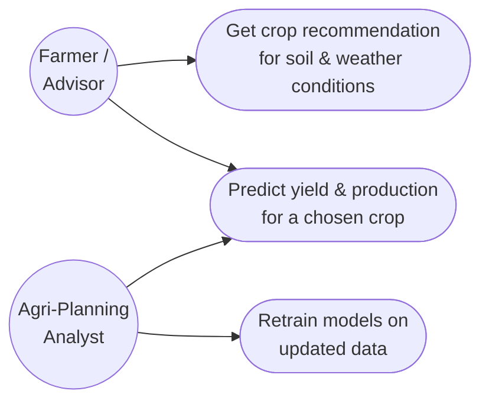
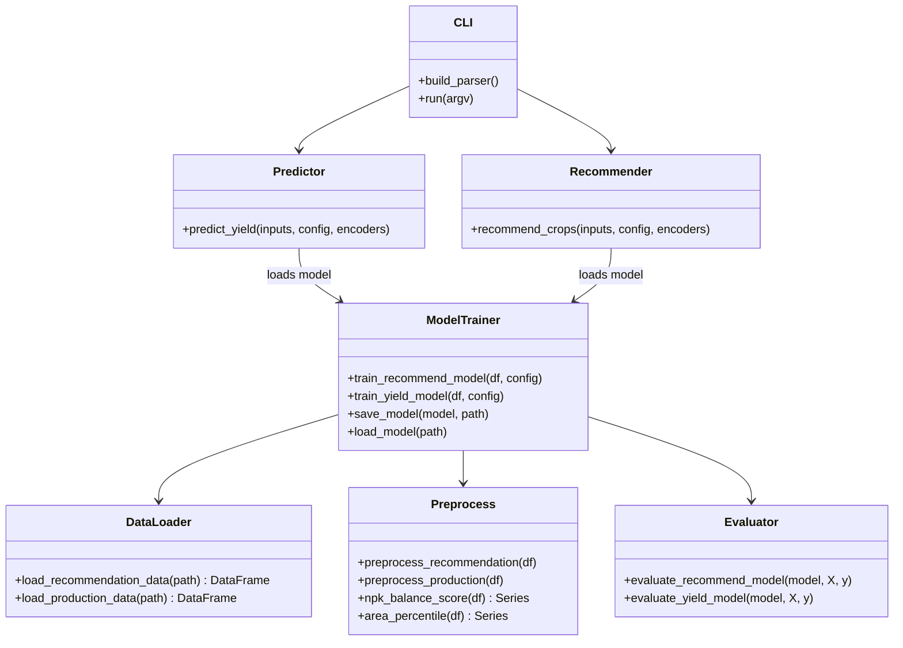
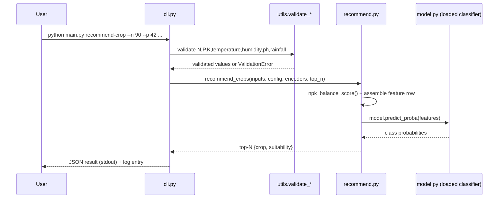

# Design Diagrams

## Already generated (via `docs/generate_diagrams.py`)

- `architecture_diagram.png` — System Architecture Diagram, showing both
  pipelines (recommendation and production/yield) from raw CSV through to
  CLI output.
- `workflow_diagram.png` — Process Flow Diagram for a `predict-yield` call,
  step by step including the validation error branch.

Regenerate either at any time with:
```bash
python docs/generate_diagrams.py
```

## Still to add (UML diagrams)

These need your own module boundaries drawn out — a starting point for
each is given below as Mermaid syntax. Render at https://mermaid.live (or
GitHub's Markdown preview / VS Code's Mermaid extension), export as PNG,
and save into this folder as `use_case_diagram.png`, `class_diagram.png`,
and `sequence_diagram.png`.

### Use Case Diagram



### Class / Component Diagram



### Sequence Diagram — `recommend-crop`


